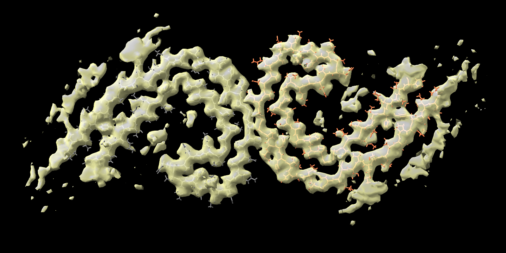

# maskChains
***maskChains*** is a [ChimeraX bundle](https://cxtoolshed.rbvi.ucsf.edu/apps/chimeraxmaskchains) bundle that adds a command *maskChains* to ChimeraX that lets you generate a mask to keep all voxels closer to the target protein chain(s) than other chains, including the voxels corresponding to the protein backbone/sidechains and those non-proteinaceous voxels around the protein. This is in contrast to the *Surface Zone* [tool](https://www.cgl.ucsf.edu/chimerax/docs/user/tools/surfacezone.html)/[command](https://www.cgl.ucsf.edu/chimerax/docs/user/commands/surface.html#zone) in ChimeraX that lets the user specify a distance limit to include voxels near the selected protein chains.

Example: [EMD_3741](https://www.ebi.ac.uk/emdb/EMD-3741) masked with chain E,F of [PDB-5o3l](https://www.rcsb.org/structure/5o3l):

### Installation
In ChimeraX, go to **Tools** menu and select **More Tools** to open the **Chimerax Toolshed**, find **maskChains** and click the **Install** button.

Alternatively, you can install it following these steps:
* Download the *ChimeraX_maskChains-1.1-py3-none-any.whl* file in the *dist* folder of this repository
* In the ChimeraX Command input box at the bottom of the display window, run this command  
`toolshed install <path/to/the/downloaded/whl/file>`

### Usage
In the ChimeraX Command input box, run this command  
`maskChains #1 model #2 chainIds E,F`

In this command,
* *#1* is the model ID of your density map, change it to the model ID in your ChimeraX session
* *#2* is the model ID of your atomic model that is superimposed into the map. Change it to the actual model ID in your ChimeraX session
* *E,F* are the chain IDs of your target chains for masking. You can specify one or more chain IDs. For amyloids, the chain IDs of the central layer are typically specified here. Your atomic model should have at least one layer above and one layer below your target layer

The ChimeraX commands below would reproduce the image above:
~~~
close all
open 3741 from emdb
open 5o3l
mask #1 model #2 chainIds E,F
volume #3 level 0.017
windowsize 800 400
camera ortho
view orient
hide #1
hide #2
show #2/E,F
style #2/E,F stick
color #3 #ffffb2bf
turn z -30
zoom 1.5
save emd-3741_pdb-5o3l_chain-EF_thresh-0.017.png
~~~

### Citation
The ***maskChains*** tool was developed for our cryo-EM project on the structures of amyloids. If you find ***maskChains*** useful, please cite this reference:

*Md Rejaul Hoq, Anllely Fernandez, Grace I. Hallinan, Sakshibeedu R. Bharath, Frank S. Vago, Daoyi Li, Kadir A. Ozcan, Holly J. Garringer, Wen Jiang, Ruben Vidal
Bernardino Ghetti. Cryo-EM structures of cotton wool plaques’ amyloid β and of tau filaments in dominantly inherited Alzheimer disease. To be published. 2024*

